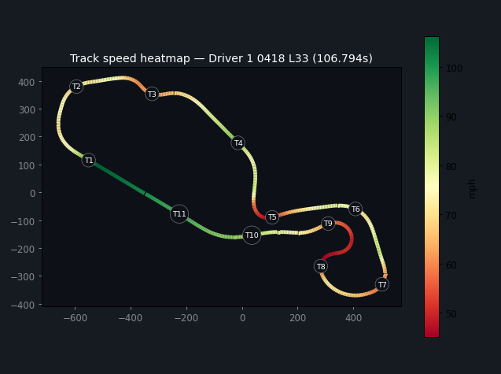
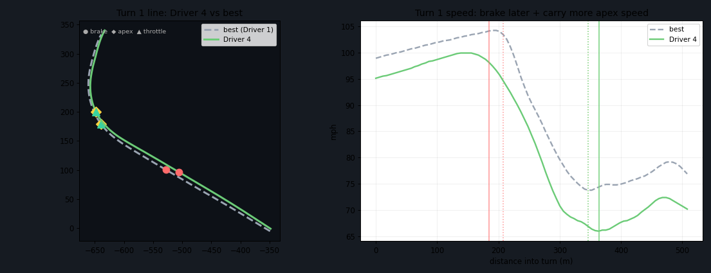

# XRK Analyzer

**A 100% local, in-browser telemetry analyzer for AiM `.xrk` data logs.** Drop in your files, get lap stats, an interactive lap player, a track-speed heatmap, turn-by-turn coaching, and "where's my lap time" opportunities — no RaceStudio, no install, no upload. Everything runs in your browser; your data never leaves your machine.

## Why this exists

AiM loggers are great. Getting at the data is not: `.xrk` is a proprietary binary format, and the official way to read it is RaceStudio 3 (Windows-centric, heavy) or a closed-source C library that only ships for Windows/Linux x64. If you're on a Mac, an iPad, or just want to glance at a session without launching a desktop app, you're stuck.

This project started as a one-off — pull the fastest laps out of a 24-hour endurance race at NJMP Thunderbolt without touching RS3 — and grew into a general tool. The realization that made it worth generalizing: **almost none of the analysis is track-specific.** The logger already writes lap markers into the file, and corners can be detected straight from the speed trace, so the same code works on any track, anywhere, with zero configuration.

The coaching layer is inspired by **Garmin Catalyst**: instead of just showing you data, it tells you *what to do differently* — brake later, carry more apex speed, get to throttle sooner — by comparing each lap, corner by corner, to the best line anyone in your data drove through that corner.

## Features

- **Drag-and-drop `.xrk` parsing** entirely in the browser (also handles `.xrz` via the browser's native decompressor).
- **Multi-file / multi-stint:** drop a whole day of sessions; label drivers; give two files the same name to merge a multi-stint driver.
- **Composite lap player:** animate any lap around the track with live speed and g-forces, compare against any other lap, scrub or play.
- **Track-speed heatmap** with auto-detected, numbered turns.
- **Turn Detail coaching** (Catalyst-style): zoomed corner map with each lap's real line vs. the best line, with brake / apex / throttle markers, a looping turn player, and plain-language suggestions.
- **Opportunities:** the lap's biggest time-loss corners ranked by seconds available, plus a full per-turn list.
- **Per-stint stats:** best, mean, median, std-dev, CV%, P95/P99, caution-lap filtering.
- **Composite "ideal lap"** = the fastest sector from anyone, stitched together, with each driver's theoretical best.

## Quick start

**Just want to see it?** Open the [live demo](https://countess427.github.io/xrk-analyzer/demo/NJMP_telemetry_demo.html) — a pre-baked build with a real race's data embedded (a 7-hour, 4-driver day at NJMP Thunderbolt). No files needed. (Or open [`demo/NJMP_telemetry_demo.html`](demo/NJMP_telemetry_demo.html) locally.)

**Analyze your own data?** Open the [analyzer](https://countess427.github.io/xrk-analyzer/) (same as `AiM_XRK_Analyzer.html`) and drag your `.xrk` files onto it. To test with the included data, drop everything in [`sample-data/`](sample-data/). Works offline too — just open [`index.html`](index.html) directly from disk.

That's it — both are single, self-contained HTML files. They work straight from disk (`file://`), offline, no server, no build step.

## How it works

### Reverse-engineering the `.xrk` format

`.xrk` is a flat binary of tagged records. Each record starts with an ASCII tag like `<hGPS`, `<hLAP`, `<hCHS` (channel header), `<hCDE` (channel data), or short metadata tags, followed by a length and a payload. The pieces this tool relies on:

- **GPS records (`<hGPS`)** — fixed 56-byte payloads at 10 Hz, holding a master-clock timestamp (ms), the GPS time-of-week (`ITOW`, ms), and the receiver's **ECEF position** (Earth-Centered, Earth-Fixed X/Y/Z, in centimetres). We convert ECEF to a local **ENU** (East/North/Up) tangent plane shared across all files, which gives a clean metric map and lets us compute speed and lateral/longitudinal g by differentiating position.
- **Lap records (`<hLAP`)** — the logger writes these itself: each holds a lap number, the lap time (ms), and the cumulative master-clock time of the start/finish crossing. So **lap and sector times are exact, straight from the device** — we don't re-derive them.
- **Metadata** — small tags carry the acquisition date/time, device name, vehicle, racer, and championship.

A nice consequence of the GPS `ITOW` field: it pins every lap to an absolute wall-clock time (GPS day-of-week + time-of-day, UTC), which is how the original project figured out which laps belonged to which driver across a multi-stint day.

The decoder is ~250 lines of dependency-free JavaScript in [`src/xrkcore.js`](src/xrkcore.js) and parses a 17 MB file in ~50 ms.

### Analysis pipeline

1. **Per-lap telemetry:** slice GPS samples into laps by the lap markers, project to ENU, compute smoothed speed and g-forces, and resample each lap onto a common 600-point grid by distance fraction (so laps line up corner-to-corner even at slightly different lengths).
2. **Turn detection:** find the speed minima on the fastest lap (prominence-based), treat each as a corner, and split the lap into segments at the midpoints between corners. No track database required.
3. **Sector timing:** integrate time across each segment, scaled so the segments sum exactly to the logger's lap time.
4. **Stats & composite ideal:** per-stint distributions, and the best segment time from anyone → a stitched "ideal lap."
5. **Coaching:** within each corner, detect the **brake point** (where longitudinal g crosses into braking), the **apex** (minimum speed), and the **throttle point** (where longitudinal g goes positive again), then compare a lap against the best lap in that corner and generate suggestions (brake later/harder, carry more apex speed, get to throttle sooner).

### Architecture

A single static HTML file. The parser runs on the raw `ArrayBuffer`; the analysis and all visualizations (canvas-based) run client-side. There is no backend by design — it's the simplest way to guarantee the data stays local and the tool stays trivially shareable.

## On track databases

You might expect this to need a database of every circuit. It mostly doesn't: lap markers are embedded in the file and turns are auto-detected. A track database only adds nicety (official track/turn names, or a start-finish line for the rare file logged with no track loaded). If you want that later, the open options are **OpenStreetMap** (`highway=raceway`, ODbL-licensed, query via Overpass) and a small community JSON of start-finish lines + turn names keyed by GPS bounding box. (RaceChrono and similar have large libraries but check their licensing before redistributing.)

## Sample data

[`sample-data/`](sample-data/) contains five real `.xrk` logs from a 24 Hours of Lemons race at NJMP Thunderbolt — one Sunday, four driver stints, ~185 laps. They're here so you can see real output and test the parser. Lap times are in the 1:46–2:00 range for a budget endurance car.

## Limitations / status

This is an early, honest prototype:

- The decoder is **validated on a Solo-type GPS logger.** Other AiM devices (MX-series, Solo 2, EVO) may use different channel/GPS layouts and will need a sample file each to tune. Contributions of sample files from other loggers are the most useful thing you can add.
- Speed and g-forces are **GPS-derived at 10 Hz** (lightly smoothed). Lap and sector times are exact; the derived channels are a strong guide, not a substitute for a high-rate accelerometer/wheel-speed feed.
- Turn boundaries and brake/apex/throttle points are auto-detected heuristics — directionally right, not millimetre-perfect.
- `.xrz` decompression uses the browser's `DecompressionStream` and is best-effort.

## Acknowledgements & references

- [AiM RaceStudio 3](https://www.aim-sportline.com/) and AiM's [XRK access DLL documentation](https://www.aim-sportline.com/docs/racestudio3/html/xrk-dll.html), which documents the data model (laps, channels, GPS-derived channels) this tool mirrors.
- Prior art that confirmed the format is tractable: [`laz-/xrk`](https://github.com/laz-/xrk) (Python DLL wrapper), [`bmc-labs/xdrk`](https://github.com/bmc-labs/xdrk) (Rust wrapper around AiM's C library), and `libxrk` (a native Cython reimplementation).
- Coaching UX inspired by Garmin Catalyst.

## License

MIT — see [LICENSE](LICENSE). The code is original; it does not include or redistribute any AiM software. AiM, RaceStudio, and XRK are trademarks of their respective owner.
